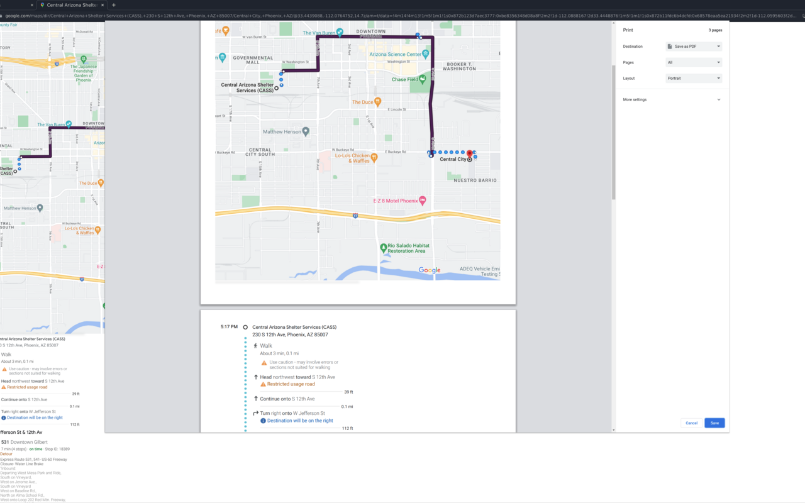

# Print Google Maps Better

Printing Google Maps sucks.

This extension makes it better.

## Install

[Chrome Extension: Print Google Maps Better](https://chrome.google.com/webstore/detail/print-google-maps-better/pjikogceiofjfblflbjifdiepfgcfmmd)

## Problem

Currently there is an issue with Google Maps printing that causes the map to be split out along multiple pages, with much of the route not even appearing in the final printed result.
Furthermore, directions are haphazardly interleaved.

With this extension, it is possible to print the map on its own page, and the directions on accompanying pages.

## Instructions

Find and select a route.

Press `P` to begin printer formatting.

Adjust the map as necessary.

Press `P` again to print.

## Example

